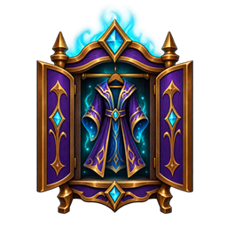

# Transmog ID

Transmog ID adds a small wardrobe icon to the default target frame when a
targeted player has a transmogrified appearance or weapon illusion.

It is made for WoW Forever beta and uses the game's inspection data. The icon
disappears when you target another unit, an NPC, or a player whose appearance
cannot be inspected.

This is a development verison of the addon and may not function as expected - check the readme for updates.

The released version is available on Curse: https://www.curseforge.com/wow/addons/transmog-id

## Installation

1. Download or copy this project folder.
2. Rename the folder to `TransmogID` if it is not already named that.
3. Place it in your WoW Forever AddOns directory:

   `World of Warcraft/_classic_beta_/Interface/AddOns/TransmogID`

4. Start the game and enable **Transmog ID** in the AddOns list on the
   character-selection screen.

## How to use it

Target a nearby player. If their displayed equipment includes a transmogged
appearance or weapon illusion, the wardrobe icon appears in the upper-right
area of the standard target frame.

Use `/tmid` to open the settings menu and a player-frame image preview.

The sliders adjust horizontal position (`-200` to `0`), vertical position
(`-90` to `0`), and size (`1x` to `4x`) with immediate preview updates.

**Save settings** stores all three values and closes the menu.

**Cancel** restores the values from when the menu opened. Closing with `/tmid` also cancels.

**Reset to defaults** previews the default position and size; Save keeps them,
and Cancel undoes the reset.

The preview disappears when the menu closes.

Note that saved settings are not currently working due to the client not reading the SavedVariables: https://us.forums.blizzard.com/en/wow/t/uiaddon-settings-wiped-on-client-restart/2353992

## What the icon means

The icon means the inspected appearance does not match at least one item the
player has equipped, or that a weapon illusion is present.

It does **not** reveal the state of WoW Forever's personal “show transmogs”
toggle. That setting is not exposed to addons. A player with the toggle enabled
but no altered appearances will not show the icon.

## Troubleshooting

- **No icon for a player:** move closer and target them again. The game only
  supplies inspection data for eligible players in range.
- **Addon is marked out of date:** enable **Load out of date AddOns**. This is
  expected while WoW Forever is in beta.
- **No addon in the list:** check that `TransmogID.toc` is directly inside the
  `TransmogID` folder, alongside `transmogid.lua` and the `media` folder.
